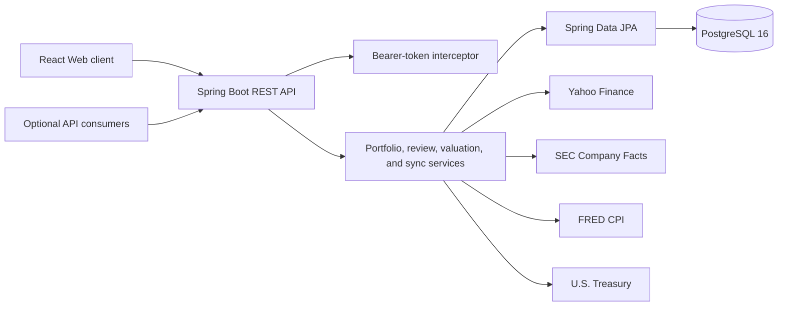

# Architecture

## Overview

The beta2 Web release is a layered monolith. The React application consumes a Spring MVC REST API; PostgreSQL stores portfolio records, market history, review overlays, and valuation inputs. Market and fundamentals services retrieve external data on demand and through scheduled jobs.

## Backend boundaries

- Controllers define additive HTTP contracts and delegate business logic.
- DTOs isolate API request/response shapes from persistence entities.
- Services calculate holdings, cash flow, market history, review overlays, valuations, and idempotent sync mutations.
- Repositories own database access; transactions remain the source of truth for position quantities and cost basis.
- Reviewed corrections are stored separately from raw market/fundamental rows and applied by the read path.
- Valuation scenario inputs are persisted, while market-sensitive results are recalculated on read.

## Frontend boundaries

- `api.js` is the only HTTP boundary and defaults to the same-origin `/api` path.
- Route pages compose reusable responsive controls, charts, dialogs, tables, and rich-text editing.
- Analytical utilities are deterministic and covered by Node/Vitest tests; authoritative valuation results come from the backend.
- Locale resources provide English, Simplified Chinese, and Japanese UI strings.

## Security and deployment

Local development defaults to permissive CORS and disabled bearer protection. Hosted deployments must restrict `APP_CORS_ALLOWED_ORIGIN_PATTERNS`, enable an appropriate authentication layer, and keep credentials outside Git. A bearer token must never be passed through `VITE_*`, because those values are public browser assets.

Database schema updates are maintained as ordered PostgreSQL scripts. Existing beta1 installations must run the documented beta2 migration before the backend is switched to `ddl-auto=validate`.
